# Important notes

No music is included in this repository due to copyright concerns.  
You must provide your own music files.

# Limitations

The maximum number of channels/instruments per song is 20.  
Going beyond this can have unpredictable results including crashes and corrupt data.

# Using the Sim City 2000 soundtrack

What I've found is that the Sim City 2000 soundtrack fits nicely, and this guide will show you how to extract and convert the music from your own data files.

## Required software

- Sim City 2000 Special Edition (Can be purchased from GOG)
- OpenMPT
- libADLMIDI
- Sim City 2000 Music Extractor (sc2kme - Included in repository)
- WINE (If you are on Mac or Linux)

## Building libADLMIDI (Mac/Linux)

Sim City 2000's music is not in a format that is readable by OpenMPT, and as such we need a tool to convert it to MIDI format.  

There is a tool in libADLMIDI called xmi2mid, but it is not enabled by default. We will need to build it and enable it during configuration.  

First, clone the libADLMIDI repository:
```
git clone https://github.com/Wohlstand/libADLMIDI
```

Next, enter the libADLMIDI directory and run the following commands:
```
mkdir build
cmake -DCMAKE_BUILD_TYPE=Release -DWITH_XMI2MID=ON ..
make
make install
```

Once built and installed, verify that xmi2mid is in your path.

## Obtaining the data file

Sim City 2000's main data file is SC2000.DAT, and you can find it in the DOS and GOG releases of Sim City 2000.  
Take note of the path to SC2000.DAT, as we will need it for running the music extractor.

## Extracting the music

Enter the sc2kme folder in the root of this repository and remember the path to SC2000.DAT that you found earlier.  
  
Extract the music:
```
python3 sc2kme.py /path/to/SC2000.DAT xmi
```

This will extract all music files from SC2000.DAT into a new directory "xmi".  
  
There are multiple versions of the soundtrack, possibly designed for different MIDI devices. For the purpose of this tutorial we're only interested in the 1XXXX.XMI series so you can delete the others.

## Converting the music to MIDI

Also in the sc2kme directory is a quick script to convert all the xmi files to midi using the xmi2mid tool.  

Enter the xmi directory that contains the extracted music and run the following command:
```
python3 ../convert_xmis.py
```

An output directory called "midis" will be created containing all of the converted files in midi format.

## Converting the music from MIDI to .it

In order to for the music to be usable, it must be converted into a format that can be easily played by the GBA.

To do this we will use the OpenMPT application, but be aware the process is involved and cannot be scripted.

### Obtaining a sound font

This guide won't go into detail about sound fonts or how they work, but basically they contain samples of musical instruments and often have the .sf2 file extension.

There are many different sound fonts available, and the one you use depends on your personal taste. For this guide, I will be using the Arachno sound font, because to my ear it sounds the best. You will need to try listening to a few tracks with your chosen sound font and see what you like.

### Using a sound font

Open up OpenMPT and right click on the folder labeled "MIDI Library" and select the option to import a MIDI library.

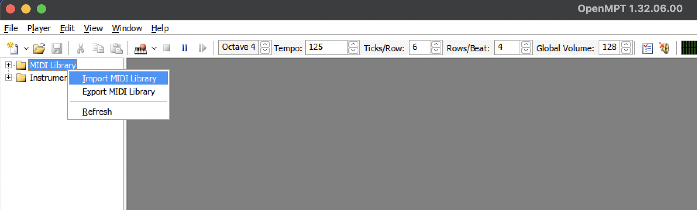

Select your chosen sound font with the file chooser dialog that pops up. You might get the following dialog box:

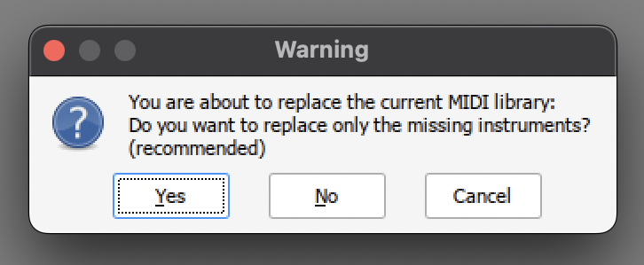

If this happens, click the button that says No so that all of the instruments are replaced.

### Converting a track

This is the most involved part of the process as a few things can go wrong. In this example, I will convert 10012-0.mid since it has the most channels used.

Open 10012-0.mid in OpenMPT and take notice of the number of channels used by the track.

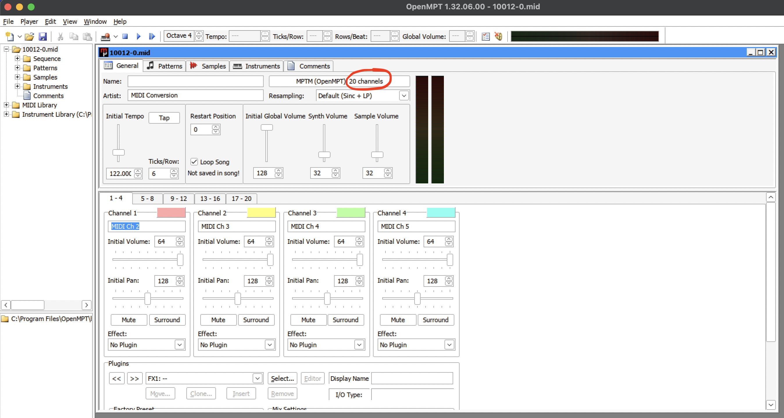

**The number of channels used must be 20 or under.**
**Using more may cause undefined behaviour.**

This is why I'm using the music from the GOG/DOS version instead of music rips found online. The newer releases of Sim City 2000 have updated music which can have up to 30 channels.

**Note: You're not limited to just music from Sim City 2000, you can probably use any MIDI as long as the channel count is at or below 20.**

Ideally you would listen to the track fully without modifications so you can know what it's supposed to sound like and be able to recognize if there were issues after conversion is complete.

Before we can actually convert the MIDI to Impulse Tracker format, we need to apply some manual fixes to the track.

Basically, we need to account for a compatibility issue when converting to the Impulse Tracker format. If we do not, some notes may get "stuck on" during playback which will sound annoying.

First, open up the patterns tab.

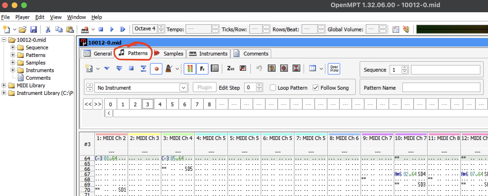

Now we need to open the edit menu and select "Find / Replace" which will bring up the find and replace dialog.

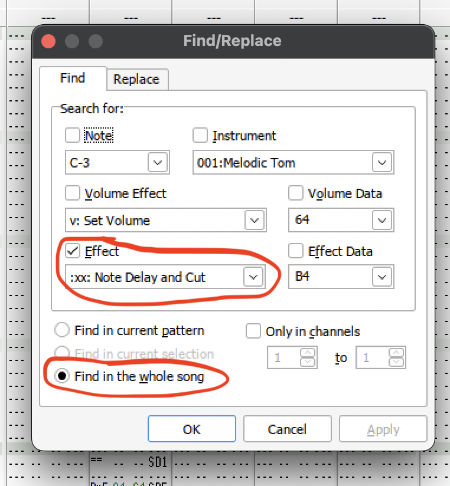

We need to find all instances of the "note delay and cut" and manually change them to just note cut.

**Note: This will likely affect the way the song sounds, and this is an imperfect fix. This is why you should listen to the track beforehand to get an idea of how it's supposed to sound**

Click OK and go to the first instance of note delay and cut. If there are none found, then you can skip this step.

The editor will select the command that needs to be edited.

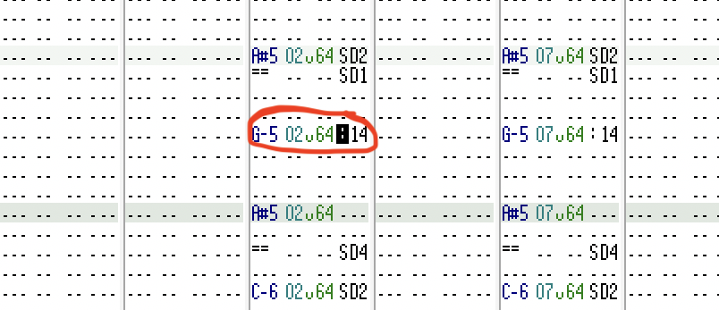

Select the last 2 digits and notice the text in the status bar.

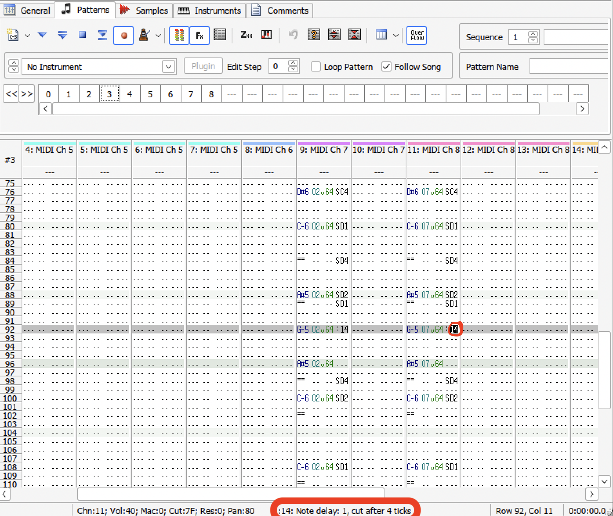

Since we cannot have both a note delay and a note cut, we'll choose to cut the note instead. In my experience this sounds fine, but it's not an accurate fix to the problem.

Keep note of the number for "cut after X ticks" in the status bar, start typing the letters (no spaces) s c X where X is the number of ticks you got from the status bar.

If you did it right, it should look like this:

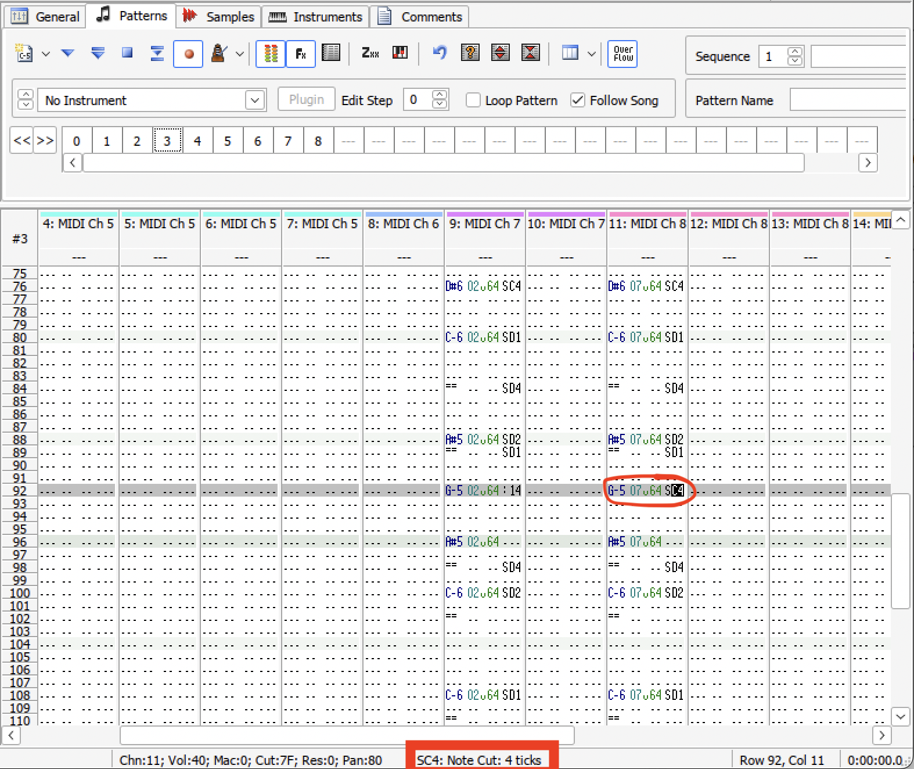

Now, do this for every other instance in the track using Edit->Find next. Make sure to check the number of ticks in the status bar each time for the correct value.

When you are done, find next will no longer come up with new results. Now we can actually convert to Impulse Tracker format.

Go back to the general tab and click the button that says "MPTM (OpenMPT)".

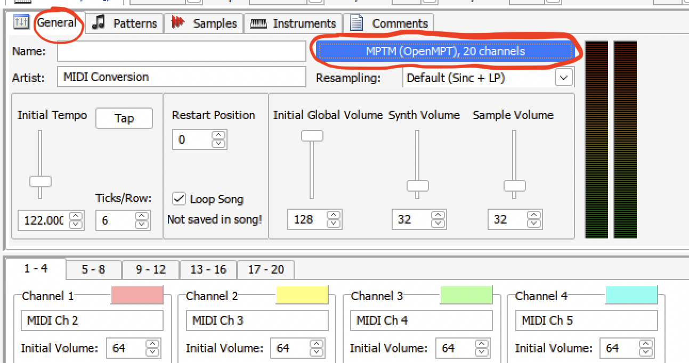

A dialog box like below will appear:

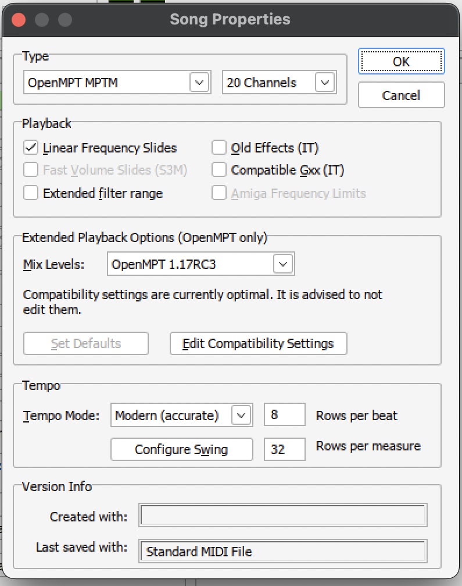

There are a few things you need to do here:

1. Set the type to Impulse Tracker IT
2. Click the "Set Defaults" button
3. Set the mix levels to Compatible

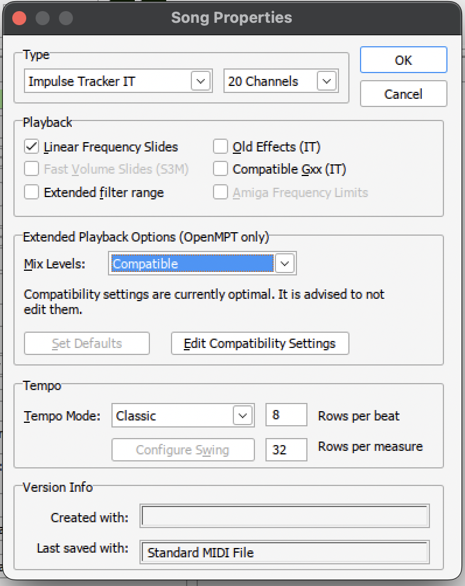

Press OK and give the song a listen.
Hopefully it sounds close to the original and there were no issues with things like stuck notes.

Now we can export the file and use it in Micropolis on the GBA. Select "Compatibility export" from the file menu.

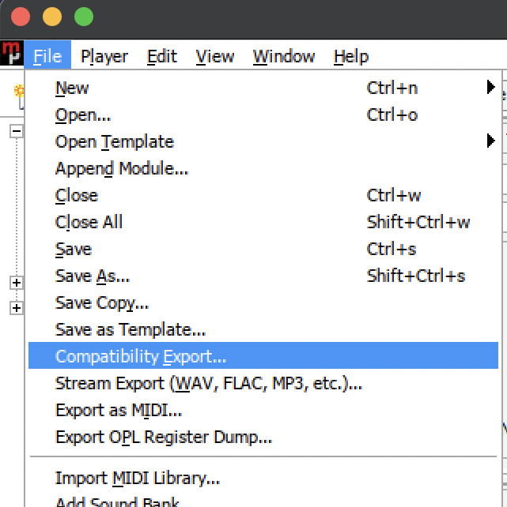

Go to the "maxmod_data" folder in the root of the micropolis-gba repository and save the .it file. Now, repeat this for as many tracks as you'd like as long as they're at or under 20 channels.

Finally, build micropolis and your music will be played in-game!.
